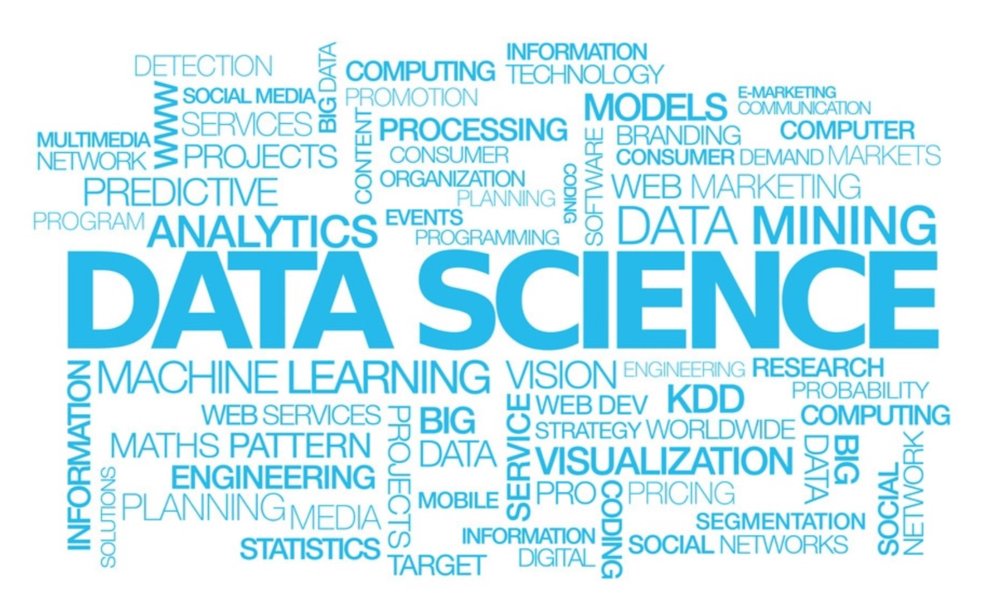

Author: [Qixing Li](https://qixing810.github.io/)

Date: Jan 29, 2019

Code: [Github](https://github.com/qixing810/CUNYSPS-DataScience) 

# Spring 2019

## [DS607 Data Acquisition and Management](/DS607/DS607.md)
In this course students will learn about core concepts of contemporary data collection and its management. Topics will include systems for collecting data (real time, sensors, open data sets, etc.) and implications for practice; types of data (textual, quantitative, qualitative, GIS, etc.) and sources; an overview of the use of data, including what and how much should be collected and the distinction between data, information, and knowledge from a data-centric point of view; provenance; managing data with and without databases; computer and data security; data cleaning, fusing, and processing techniques; combining data from different sources; storage techniques including very large data sets; and storing data keeping in mind privacy and security issues.
1. [Asignments](/DS607/DS607.md)
2. Project
3. 

 

## [DS606 Statistics and Probability for Data Analytics](/DS606/DS606.md)
This course covers basic techniques in probability and statistics that are important in the field of data analytics. Discrete probability models, sampling from infinite and finite populations, statistical distributions, basic Bayesian statistics, and non-parametric statistical techniques for categorical data are covered in this course. Each of these statistical concepts will be applied in a variety of real-world scenarios through the use of case studies and customized data sets.
1. [Asignments](/DS606/DS606.md)
2. Project
3. 

 
## About School
1.[CUNYSPS](https://sps.cuny.edu/academics/graduate/master-science-data-science-ms)

2.[Full Curriculum](http://catalog.sps.cuny.edu/preview_program.php?catoid=2&poid=607)